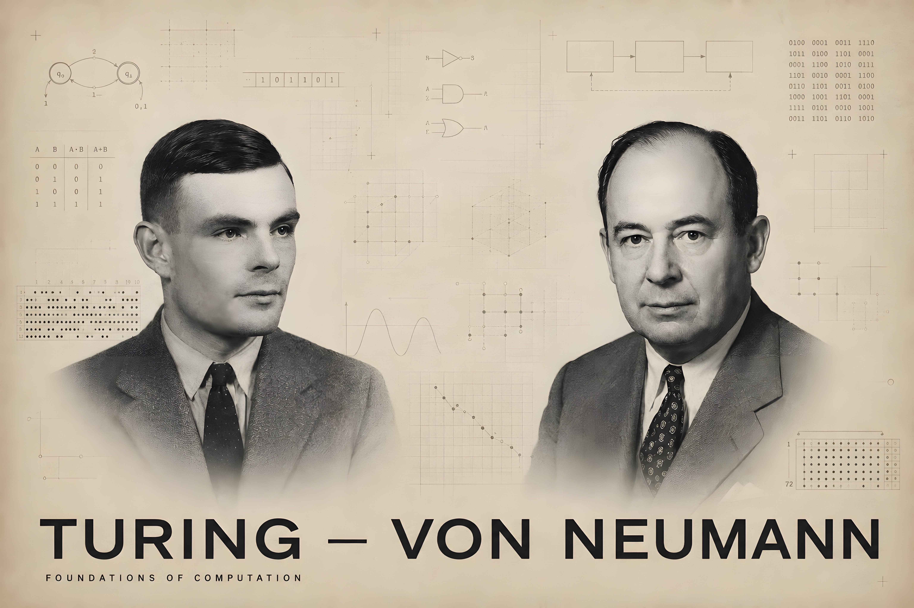

# Omarchy Giants Theme

Standing on the shoulders of giants. A warm, low-contrast dark theme for
[Omarchy](https://omarchy.org) built around ink on aged paper: sepia and cream
foregrounds over a soft brown-black background, with a dusty terracotta accent.

## Install

```bash
omarchy theme install https://github.com/dhh/omarchy-giants-theme
```

## Palette

| Role | Hex |
| --- | --- |
| Background | `#27241f` |
| Dark background | `#1d1b17` |
| Darker background | `#141210` |
| Lighter background | `#3d3a35` |
| Foreground | `#E1D5C2` |
| Accent | `#97786d` |
| Selection | `#E1D5C2` |
| Muted | `#5f5d57` |

Full ANSI palette in [`colors.toml`](colors.toml). Icons are `Yaru-wartybrown`.

## Wallpaper


