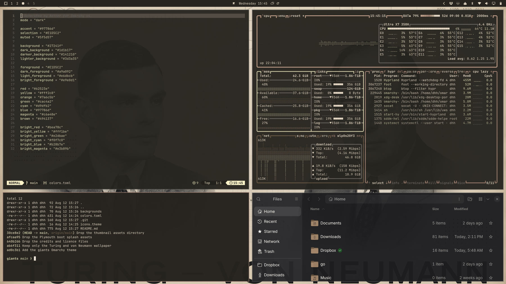

# Omarchy Giants Theme

Standing on the shoulders of giants. A warm, low-contrast dark theme for
[Omarchy](https://omarchy.org) built around ink on aged paper: sepia and cream
foregrounds over a soft brown-black background, with a dusty terracotta accent.




## Additional wallpapers

The collection now also includes sixteen generated portraits of influential
computer scientists and software pioneers:

- [Linus Torvalds](backgrounds/2-linus-torvalds.jpg) — Linux kernel and Git
- [Ada Lovelace](backgrounds/3-ada-lovelace.jpg) — algorithmic computing and the Analytical Engine
- [Grace Hopper](backgrounds/4-grace-hopper.jpg) — compilers and COBOL
- [Donald Knuth](backgrounds/5-donald-knuth.jpg) — algorithms, TeX, and technical publishing
- [Barbara Liskov](backgrounds/6-barbara-liskov.jpg) — data abstraction and distributed systems
- [Margaret Hamilton](backgrounds/7-margaret-hamilton.jpg) — Apollo flight software and software engineering
- [Dennis Ritchie](backgrounds/8-dennis-ritchie.jpg) — C and Unix
- [Ken Thompson](backgrounds/9-ken-thompson.jpg) — Unix and operating systems
- [Tim Berners-Lee](backgrounds/10-tim-berners-lee.jpg) — the World Wide Web and hypertext
- [Niklaus Wirth](backgrounds/11-niklaus-wirth.jpg) — Pascal, Modula-2, and Oberon
- [Edsger Dijkstra](backgrounds/12-edsger-dijkstra.jpg) — structured programming and algorithms
- [John Backus](backgrounds/13-john-backus.jpg) — FORTRAN, BNF, and compilers
- [C. A. R. Hoare](backgrounds/14-tony-hoare.jpg) — program verification and Hoare logic
- [Adleman · Rivest · Shamir](backgrounds/15-adleman-rivest-shamir.jpg) — RSA public-key cryptography
- [Alan Kay](backgrounds/16-alan-kay.jpg) — Dynabook, Smalltalk, and object-oriented personal computing
- [Bill Joy](backgrounds/17-bill-joy.jpg) — vi, BSD Unix, TCP/IP, and Sun Microsystems

The wallpapers use the same aged-paper, monochrome ink, technical-diagram,
and terracotta-accent treatment as the original. Research notes, source
portrait credits, licenses, and generation details are in
[CREDITS.md](CREDITS.md).

## Install

```bash
omarchy theme install https://github.com/dhh/omarchy-giants-theme
```

## Palette

| Role | Hex |
| --- | --- |
| Background | `#27241f` |
| Dark background | `#1d1b17` |
| Darker background | `#141210` |
| Lighter background | `#3d3a35` |
| Foreground | `#E1D5C2` |
| Accent | `#97786d` |
| Selection | `#4f4840` |
| Muted | `#8a857a` |

Full ANSI palette in [`colors.toml`](colors.toml). Icons are `Yaru-wartybrown`.
